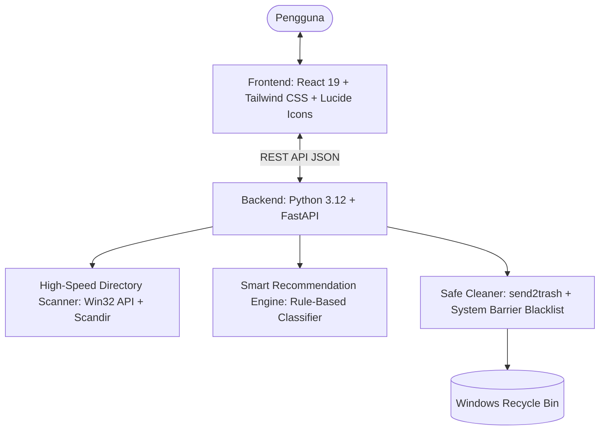

# 🔍 DiskLens — Smart Disk Analyzer & Cleanup Advisor

<div align="center">


**Penerus modern WinDirStat dengan fitur unggulan: *"Better Hapus yang Mana?"* (Smart Recommendation Engine)**

[Fitur Utama](#-fitur-utama) • [Cara Instalasi](#-cara-instalasi--menjalankan) • [Arsitektur](#-arsitektur-sistem) • [Keamanan](#-proteksi-keamanan-data) • [Lisensi](#-lisensi)

</div>

---

## 💡 Mengapa DiskLens?

Banyak pengguna Windows mengalami masalah **Disk C tiba-tiba penuh** akibat cache browser puluhan tab (Chrome/Edge), file render video (CapCut), package manager (`npm`, `pip`), atau file profil lama yang rusak.

Aplikasi seperti **WinDirStat / TreeSize** memang bagus untuk memetakan ukuran folder, namun **tidak memberi tahu pengguna awam file mana yang aman dihapus**. Akibatnya, pengguna takut salah menghapus file sistem atau bingung menentukan prioritas.

**DiskLens hadir memecahkan masalah ini:**
1. 🚀 **Visualizer Cepat**: Memetakan hierarki ukuran folder terbesar dalam hitungan detik.
2. 🧠 **Smart Advisor ("Better Hapus Yang Mana?")**: Secara otomatis mengklasifikasikan sampah ke dalam **3 Zona Keamanan**.
3. 🛡️ **Aman 100%**: File dipindahkan ke **Windows Recycle Bin** (bisa di-restore) dan file sistem inti di-blacklist secara ketat.

---

## ✨ Fitur Utama

### 1. 🧠 Smart Advisor (3 Zona Keamanan)
* 🟢 **Zona Hijau (Safe to Delete - 100% Aman)**:
  * Cache Google Chrome, Microsoft Edge, Brave (Web cache, GPUCache, Media cache).
  * Windows `%TEMP%` & User Temp files.
  * Node.js (`npm-cache`) & Python (`pip cache`).
  * Windows Update & `DeliveryOptimization` cache.
  * AMD / DirectX Shader Caches.
* 🟡 **Zona Kuning (Review Needed - Disarankan Ditinjau)**:
  * Folder profil browser lama/rusak (`Profile.corrupted_*`, `Profile.old`).
  * Cache rendering & proxy CapCut.
  * Cache offline musik Spotify.
  * Installer lama di folder Downloads (> 30 hari).
* 🔴 **Zona Merah (System Protected - Terkunci & Aman)**:
  * Folder sistem `C:\Windows`, `pagefile.sys` (Virtual RAM), `hiberfil.sys`, dan driver terlindungi dari penghapusan tidak disengaja.

### 2. 📊 Visual Disk Hierarchy & Explorer
* Daftar folder terurut dari ukuran terbesar ke terkecil lengkap dengan persentase bar visual.
* Breadcrumb navigasi dan fitur instan *"Buka di Windows Explorer"*.
* Filter dan pencarian file/folder cepat.

### 3. 🛡️ One-Click Safe Cleanup
* Pilihan pembersihan: Pindahkan ke **Windows Recycle Bin** (default) atau **Hapus Permanen**.
* Penanganan file yang sedang dikunci aplikasi secara aman tanpa membuat aplikasi crash.
* Laporan langsung berapa Gigabyte ruang penyimpanan yang berhasil dipulihkan.

### 4. 🎨 Antarmuka Modern (Glassmorphism Dark Mode)
* Dibangun dengan **React 19**, **Tailwind CSS**, dan **Lucide Icons** bertema gelap futuristik yang nyaman di mata.

---

## 🏗️ Arsitektur Sistem



---

## 🚀 Cara Instalasi & Menjalankan

### Persyaratan Sistem:
- **Windows 10 / 11**
- **Python 3.10+**
- **Node.js 18+**

### Langkah Cepat (One-Click Launcher):
Cukup klik dua kali file **`start.bat`** di direktori utama, aplikasi akan otomatis menginstall dependensi, membangun frontend, dan membuka browser di `http://127.0.0.1:8000`.

### Menjalankan Secara Manual:

#### 1. Setup Backend:
```bash
cd backend
pip install -r requirements.txt
python main.py
```

#### 2. Setup Frontend (Mode Pengembang):
```bash
cd frontend
npm install
npm run dev
```
Buka browser di `http://localhost:5173`.

#### 3. Build Frontend untuk Produksi:
```bash
cd frontend
npm run build
```
Setelah di-build, jalankan `python backend/main.py` dan akses di `http://127.0.0.1:8000`.

---

## 🔒 Proteksi Keamanan Data

DiskLens dirancang dengan prinsip **Safety-First**:
1. **System Path Blacklist**: Hard-coded blocking untuk jalur krusial seperti `C:\Windows`, `C:\Windows\System32`, `C:\Program Files`, `pagefile.sys`, dan direktori root drive.
2. **Recycle Bin by Default**: Penghapusan memanfaatkan Windows Shell API (`send2trash`), sehingga file dapat dikembalikan dari Recycle Bin kapan saja.
3. **Locked File Resilience**: File yang sedang digunakan oleh aplikasi yang sedang aktif dilewati dengan aman tanpa memaksa terminate proses.

---

## 📄 Lisensi

Proyek ini dilisensikan di bawah lisensi **MIT License** — bebas digunakan, dimodifikasi, dan didistribusikan.
